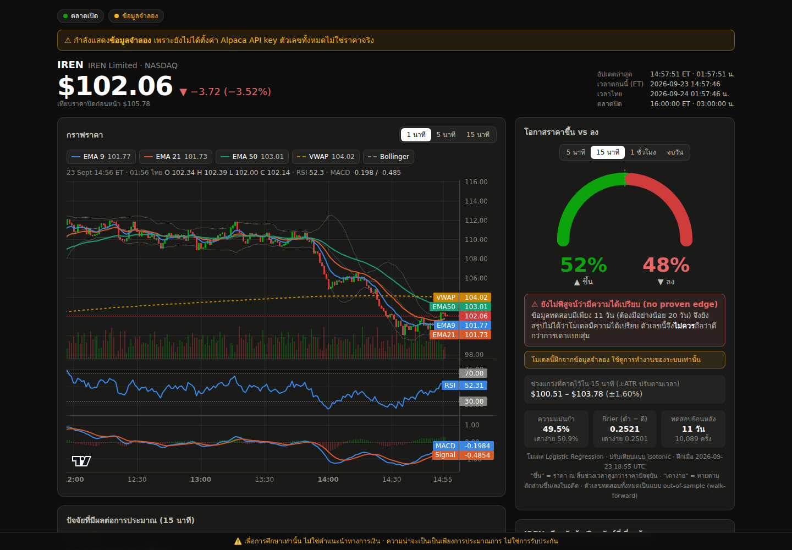
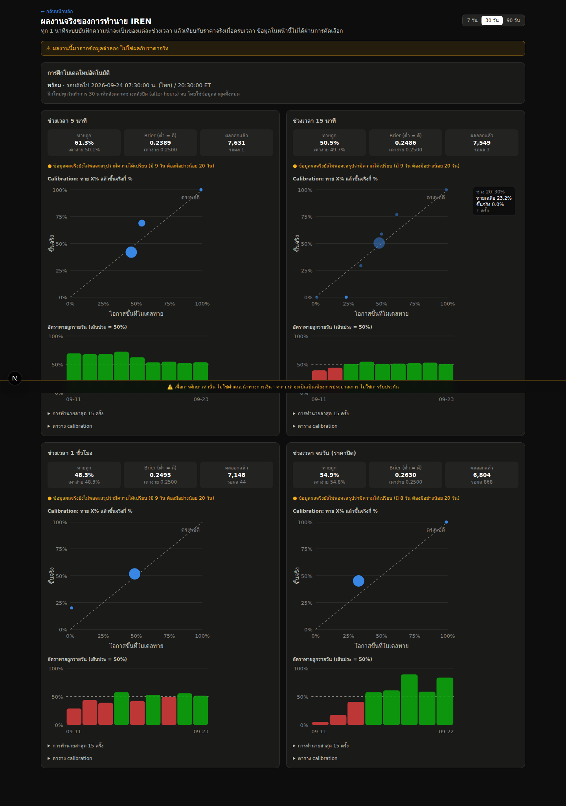

# IREN Probability Analyzer

A real-time dashboard for **IREN Limited (NASDAQ: IREN)**. At any moment it estimates the
probability that the price will be **higher or lower** after 5 minutes, 15 minutes, 1 hour, or at
the day's close. The probabilities are calibrated and measured against a naive baseline, and the
app keeps a live track record that you can check.

> ⚠️ **เพื่อการศึกษาเท่านั้น ไม่ใช่คำแนะนำทางการเงิน ความน่าจะเป็นเป็นเพียงการประมาณการ ไม่ใช่การรับประกัน**
> For education only. Not financial advice. Probabilities are estimates, not guarantees.

🇹🇭 **คู่มือภาษาไทยสำหรับมือใหม่: [README.th.md](README.th.md)**


<sub>Screenshot with simulated demo data: none of the numbers are real prices.</sub>

## What it does

- **Live data:** IREN trades, quotes and 1-minute bars over WebSocket, with auto-reconnect,
  REST polling fallback and gap filling. Context tickers are CIFR, NBIS, CRWV, NVDA, QQQ and
  BTC/USD. It shows the market session (pre-market, regular, after-hours, closed) and every time
  in both US Eastern and Bangkok time.
- **Live analysis on every bar:** EMA 9/21/50, VWAP, RSI(14), MACD(12,26,9), Bollinger(20,2),
  ATR(14) and relative volume, each with a bullish / bearish / neutral signal and one Thai
  sentence explaining why. Also rolling correlation and relative strength vs the context tickers.
- **Probability engine:** logistic regression and LightGBM, walk-forward validation only,
  calibration (average of isotonic and Platt), accuracy and Brier score vs a naive baseline, and a clear
  **"no proven edge"** warning when the model doesn't beat it. It also shows SHAP top factors
  and an ATR-based expected move range.
- **Track record:** a snapshot every minute per horizon; outcomes are filled in automatically.
  The track-record page shows hit rate and a calibration chart. Models retrain every night after
  the market closes.
- **UI:** Thai text (indicator names in English), dark mode, mobile-first, and a permanent
  disclaimer.

## Contents
1. [Quick start with Docker (easiest)](#1-quick-start-with-docker-easiest)
2. [Quick start without Docker](#2-quick-start-without-docker)
3. [Get your Alpaca API keys](#3-get-your-alpaca-api-keys)
4. [First real run: history, training, backtest](#4-first-real-run-history-training-backtest)
5. [Using the dashboard](#5-using-the-dashboard)
6. [Deploy to the internet](#6-deploy-to-the-internet)
7. [Configuration](#7-configuration)
8. [How it works](#8-how-it-works)
9. [Tests and CI](#9-tests-and-ci)
10. [Troubleshooting](#10-troubleshooting)
11. [Project structure](#11-project-structure)
12. [Limitations and honesty](#12-limitations-and-honesty)

---

## 1. Quick start with Docker (easiest)

You only need [Docker Desktop](https://www.docker.com/products/docker-desktop/) (Windows, Mac
or Linux).

```bash
git clone https://github.com/pattanarat49-lab/Iren-analyzer.git
cd Iren-analyzer
cp .env.example .env          # Windows (PowerShell): copy .env.example .env
# open .env in a text editor and paste your Alpaca keys (step 3). You can skip this for demo mode.
docker compose up --build
```

Open **http://localhost:3000**. The API is at http://localhost:8000/api/status.

Without keys the app runs in **demo mode**. The prices are simulated, a yellow banner says so,
and demo data is stored separately from real data.

To train the models inside Docker (after adding keys):

```bash
docker compose exec backend python -m scripts.backfill   # 2 years of history, ~10-30 min
docker compose exec backend python -m scripts.train      # a few minutes
```

## 2. Quick start without Docker

You need **Python 3.11+** and **Node.js 20+**. Open two terminals.

**Terminal 1: backend**
```bash
cd backend
python3 -m venv .venv
source .venv/bin/activate            # Windows: .venv\Scripts\activate
pip install -r requirements-dev.txt
cp ../.env.example .env              # then paste your keys into backend/.env
uvicorn app.main:app --reload --port 8000
```

**Terminal 2: frontend**
```bash
cd frontend
npm install
npm run dev
```

Open **http://localhost:3000**. On your phone, use `http://<your-computer's-IP>:3000` while on
the same Wi-Fi.

## 3. Get your Alpaca API keys

The app uses [Alpaca](https://alpaca.markets) market data. The free plan is enough to start.

1. Sign up at https://alpaca.markets. A **paper trading** account is fine; no money is needed.
2. In the dashboard, open the **Paper** account and find **API Keys** on the right side.
3. Click **Generate New Keys** and copy the **Key ID** and the **Secret Key**. The secret is
   shown only once.
4. Paste them into `.env`:
   ```
   ALPACA_API_KEY_ID=PK...
   ALPACA_API_SECRET_KEY=...
   ```
5. Restart the backend.

**Never commit `.env` or paste keys into chats or issues.** The keys stay on the server; the
browser only talks to your backend.

**Free vs paid feed:** the free plan streams real-time trades from the IEX exchange only. Prices
are accurate, but **volume, VWAP and relative volume** cover just part of the market (the app
labels this). The $99/month *Algo Trader Plus* plan gives the full market (SIP). After
upgrading, set `ALPACA_STOCK_FEED=sip`; no code changes are needed.

## 4. First real run: history, training, backtest

With keys set, run these from `backend/`:

```bash
python -m scripts.backfill      # download 2 years of 1-minute bars (resumable; re-run anytime)
python -m scripts.train         # train models for all 4 horizons -> models/alpaca/
python -m scripts.backtest      # out-of-sample report -> reports/backtest-alpaca-<time>.md
```

Then start (or keep running) the server. It loads the models automatically. From then on:

- a prediction is stored every minute for each horizon, and outcomes are filled in as each
  horizon ends;
- every trading day, 30 minutes after the extended session ends (20:30 ET = 07:30 Bangkok time),
  the server downloads the new bars and **retrains automatically**.

### Daily backtest on GitHub Actions

`.github/workflows/daily-backtest.yml` repeats the three commands above every US trading day
(22:30 UTC, 05:30 Bangkok time) and commits the result to
[`docs/backtest-latest.md`](docs/backtest-latest.md) (plus `.json`). It needs two repository secrets
under **Settings → Secrets and variables → Actions**: `ALPACA_API_KEY_ID` and
`ALPACA_API_SECRET_KEY`. The bar database is kept in the Actions cache between runs; the trained
models are attached to each run as a downloadable artifact. Start a run by hand from the
**Actions** tab with **Run workflow**. After each run, `.github/workflows/pages.yml` publishes a results page
(`site/index.html`, which reads `backtest-latest.json`) to GitHub Pages. Turn it on once under
**Settings → Pages → Source: GitHub Actions** (Pages on a private repository needs a paid GitHub plan).
The same workflow also runs every 5 minutes on US trading days: `scripts/live_snapshot.py` fetches the
newest bars and quotes and scores them with the saved models, so the page shows the current price,
indicator signals and P(up) per horizon. It is near-real-time (GitHub may start scheduled runs
late); for tick-by-tick updates run the full app. This is a scheduled job, not a live server: for the live
dashboard see [Deploy to the internet](#6-deploy-to-the-internet).

## 5. Using the dashboard

| Panel | What it tells you |
|---|---|
| Header | Live price, change vs previous close, after-hours change, bid/ask, last update (ET and Bangkok), session, connection (real-time / REST fallback / demo / error), halt banner |
| Up vs Down gauge | P(up) and P(down) for the chosen horizon. **A red "no proven edge" box means the model has not beaten the naive baseline in testing; treat the number as a coin flip.** It also shows accuracy and Brier score vs the baseline, the number of test days, and the expected move range |
| Price chart | 1 / 5 / 15-minute candles with EMA 9/21/50, VWAP and Bollinger overlays, volume, and RSI and MACD panes. Hover for exact values |
| Factors | The inputs pushing the current estimate up (▲) or down (▼), from SHAP values. They describe the model, not causes |
| Indicator signals | Each indicator's value, signal and a one-sentence Thai explanation |
| Context tickers | IREN vs CIFR, NBIS, CRWV, NVDA, QQQ and BTC: correlation and relative strength |
| Track record (`/track-record`) | Real, unfiltered live results: hit rate, Brier vs baseline, calibration chart, daily hit rate, recent predictions |



## 6. Deploy to the internet

The **backend** must run continuously (it streams data and retrains nightly), so it goes on a
container host with a persistent disk. The **frontend** goes on Vercel. Run **one** backend
instance only: live state, the scheduler and SQLite live in that one process.

### 6a. Backend on Railway (simplest)
1. Push this repo to GitHub (already done if you are reading this there).
2. At https://railway.app, choose **New Project → Deploy from GitHub repo** and pick this repo.
3. In the service **Settings**, set **Root Directory** to `backend`. The Dockerfile is
   detected automatically.
4. In **Variables**, add `ALPACA_API_KEY_ID`, `ALPACA_API_SECRET_KEY`, and
   `CORS_ORIGINS=https://<your-frontend>.vercel.app`. You can fill this in after step 6c.
5. Add a **Volume** mounted at `/app/var`. The database and models live there.
6. Under **Networking**, click **Generate Domain** and note the URL, e.g.
   `https://iren-api.up.railway.app`.
7. Open a shell on the service and run `python -m scripts.backfill && python -m scripts.train`
   once. After that, the nightly job keeps it up to date.

Optional: add Railway's PostgreSQL plugin and set `DATABASE_URL` to its URL instead of using
SQLite on the volume. `postgres://` URLs are handled automatically.

### 6b. Backend on Fly.io (alternative)
```bash
cd backend
cp fly.toml.example fly.toml         # edit `app` and CORS_ORIGINS
fly launch --no-deploy --copy-config
fly volumes create iren_var --size 3 --region sin
fly secrets set ALPACA_API_KEY_ID=... ALPACA_API_SECRET_KEY=...
fly deploy
fly ssh console -C "python -m scripts.backfill"
fly ssh console -C "python -m scripts.train"
```
The example config keeps one machine always running with 2 GB RAM, which the nightly training
needs.

### 6c. Frontend on Vercel
1. At https://vercel.com, choose **Add New → Project** and import this repo.
2. Set **Root Directory** to `frontend`.
3. Add the environment variable `NEXT_PUBLIC_BACKEND_URL=https://<your-backend-url>` (no
   trailing slash). It is public; never put API keys in `NEXT_PUBLIC_` variables.
4. Deploy, then put the Vercel URL into the backend's `CORS_ORIGINS` and redeploy the backend.

The WebSocket automatically uses `wss://` when the backend URL is `https://`.

**Cost:** a small always-on backend with 2 GB RAM usually costs a few US$ per month on Railway
or Fly.io (check their current pricing). Vercel's hobby tier is free for personal use.

## 7. Configuration

All settings are environment variables, read from `.env` (repo root or `backend/`) or from the
host.

| Variable | Default | Meaning |
|---|---|---|
| `ALPACA_API_KEY_ID`, `ALPACA_API_SECRET_KEY` | – | Alpaca keys (server only). Also accepted: `APCA_API_KEY_ID`/`APCA_API_SECRET_KEY` and `ALPACA_APIKEY`/`ALPACA_SECRETKEY` |
| `ALPACA_STOCK_FEED` | `iex` | `iex` (free) or `sip` (paid, full market) |
| `ALPACA_HISTORY_FEED` | same as live | Feed for backfill; keep equal to the live feed so volume features match |
| `DATA_SOURCE` | `auto` | `auto` = Alpaca if keys are set, else demo; or force `alpaca` / `demo` |
| `DATABASE_URL` | `sqlite:///data/iren.db` | SQLite file or PostgreSQL URL |
| `MODELS_DIR` | `models/` | Where trained models are stored (`<dir>/alpaca`, `<dir>/demo`) |
| `PRIMARY_SYMBOL` | `IREN` | Symbol to predict |
| `CONTEXT_SYMBOLS` | `CIFR,NBIS,CRWV,NVDA,QQQ` | Comparison stocks (also model features) |
| `CRYPTO_SYMBOLS` | `BTC/USD` | Crypto context |
| `HISTORY_YEARS` | `2` | Years of history for backfill and training |
| `POLL_INTERVAL_S` | `10` | REST polling interval while the WebSocket is down |
| `RETRAIN_ENABLED`, `RETRAIN_DELAY_MIN` | `true`, `30` | Nightly retrain, minutes after the extended session ends |
| `CORS_ORIGINS` | `http://localhost:3000` | Comma-separated frontend URLs allowed to call the API |
| `NEXT_PUBLIC_BACKEND_URL` (frontend) | same host, port 8000 | Public backend URL, fixed at build time |

## 8. How it works

```
Alpaca WebSocket + REST ─▶ MarketHub ─▶ bars (SQLite/Postgres) ─▶ AnalysisEngine (indicators, peers)
                             │                                     └▶ Predictor (models) ─▶ predictions table
                             └──── /ws + REST API ──────────────────────────▶ Next.js dashboard
Nightly: backfill ─▶ train (walk-forward, calibrate, evaluate) ─▶ models/ ─▶ hot-reloaded
Every 30 s: resolve predictions whose horizon has passed ─▶ /track-record
```

**Live data.** Separate stock and crypto WebSocket streams, with exponential-backoff reconnect
and a watchdog that recycles a socket that goes silent during regular hours. While any stream is
down, the app polls REST every 10 s and fills gaps after reconnecting. A token bucket keeps REST
under the free plan's 200 requests/min and honours `Retry-After`. Halts are detected from
Alpaca's status channel (H/P/Q codes); a "no trades for 5 minutes during regular hours"
heuristic covers plans without that channel. Sessions follow the NYSE calendar, including
holidays and half days.

**Indicators** follow TradingView/TA-Lib conventions: EMA seeded with an SMA, Wilder RSI and ATR,
population-σ Bollinger, and VWAP anchored to each US/Eastern day. RSI matches StockCharts'
published example. Every indicator is causal: a test verifies that computing on a prefix gives
identical values.

| Indicator | Signal rule |
|---|---|
| EMA 9 / 21 / 50 | price above → bullish, below → bearish, within 0.05% → neutral. Also notes 9/21 crosses and the 9 > 21 > 50 stack |
| VWAP | above → bullish, below → bearish |
| RSI(14) | ≥70 overbought → bearish; ≤30 oversold → bullish; 55–70 bullish; 30–45 bearish |
| MACD | recent cross or widening histogram → that direction; shrinking histogram → neutral |
| Bollinger | above upper → bearish (stretched); below lower → bullish; upper/lower half → bullish/bearish; flags squeezes |
| ATR | always neutral (size of moves, not direction) |
| Relative volume | cumulative volume today ÷ prior-20-day average at the same time; ≥1.5× confirms the day's direction |

**Probability engine.**
- *Label:* "up" = the last trade price at the horizon is strictly above the price now. End of
  day = the next regular close. Intraday labels never cross into another trading day.
- *Features:* returns over 1–60 min; distance to EMAs and VWAP; RSI; MACD; Bollinger; ATR;
  relative volume; volatility regime; change vs previous close; position in today's range; peer
  and BTC returns plus IREN's relative strength vs each; time of day, day of week, session, and
  minutes to the close.
- *Validation:* expanding-window walk-forward over the most recent half of the days, with
  training rows purged by label end time. Calibration uses the most recent 20% of each training
  window.
- *Edge rule:* the Brier score must beat the base-rate baseline with 95% confidence (day-block
  bootstrap) on at least 20 test days, and accuracy must be higher. Otherwise the app shows
  **no proven edge**.
- *Explanations:* LightGBM TreeSHAP, or coefficient × standardised value for logistic
  regression.
- *Expected move:* ±ATR(1-min) × √minutes.

**Track record.** Each prediction is scored with the training-label definition. Missing data
makes a prediction wait; after 3 days it is voided rather than guessed. The live page applies
the same significance test before it ever says "better than the simple guess".

## 9. Tests and CI

```bash
cd backend && pytest                        # 87 tests: indicators, data layer, models, tracking
cd frontend && npm run lint && npx tsc --noEmit && npm run build
```

Notable tests:
- RSI matches a published reference table.
- Features are causal, and live-window features equal training features.
- Walk-forward training never sees a test label.
- The model pipeline reports **no edge on a random walk** and **finds a planted signal** with
  calibrated probabilities.
- Outcomes are scored with the same-day rule.

Set `TEST_DATABASE_URL=postgresql+psycopg://…` to run the database tests on PostgreSQL.
GitHub Actions (`.github/workflows/ci.yml`) runs all of this, including a PostgreSQL service, on
every push.

## 10. Troubleshooting

| Symptom | Fix |
|---|---|
| Yellow "ข้อมูลจำลอง" (demo) banner | No keys found. Check `.env` location and variable names, then restart the backend |
| Red error "Alpaca rejected the request" (401/403) | Wrong keys, or `ALPACA_STOCK_FEED=sip` on the free plan. Use `iex` |
| "ติดต่อเซิร์ฟเวอร์ไม่ได้" in the browser | Backend not running, wrong `NEXT_PUBLIC_BACKEND_URL`, or the frontend URL missing from `CORS_ORIGINS` |
| Gauge says "ยังไม่ได้ฝึกโมเดล" | Run `python -m scripts.backfill` then `python -m scripts.train` |
| "no proven edge" on every horizon | Expected and honest for many stocks and periods. It is not a bug |
| Nothing moves outside US market hours | Normal. Prices update when trades happen; BTC trades 24/7 |
| Nightly retrain failed | See the retrain box on `/track-record` or `GET /api/models`; often low memory (use ≥2 GB) |

## 11. Project structure

```
backend/
  app/
    data/        Alpaca WebSocket + REST clients, MarketHub, demo simulator
    market/      NYSE session clock, ET/Bangkok time formatting
    analysis/    indicators, Thai signal rules, peer correlation, AnalysisEngine
    model/       features/labels, training + evaluation, predictor, tracking, nightly scheduler
    db.py        schema (bars, predictions, events) + queries
    main.py      FastAPI app: REST + /ws
  scripts/       backfill.py, train.py, backtest.py
  tests/
frontend/
  src/app/       dashboard (/) and /track-record pages
  src/components gauge, chart, panels, track-record charts
  src/lib        WebSocket hook, types, formatting
docs/PLAN.md     provider comparison and phase plan
docker-compose.yml, .github/workflows/ci.yml
```

## 12. Limitations and honesty

- Short-horizon direction for one stock is close to a coin flip. Realistic out-of-sample
  accuracy is around 50–54%, and "no proven edge" is a common result. The app is built to show
  that, not hide it.
- Backtests ignore trading costs and slippage. Past results do not guarantee future results.
- On the free IEX feed, volume-based features only see part of the market.
- CRWV (listed March 2025) and NBIS (resumed October 2024) have shorter histories; the models
  handle their missing data.
- A possible future addition: news and analyst-rating sentiment as an extra model feature.

*For education only. Not financial advice.*
