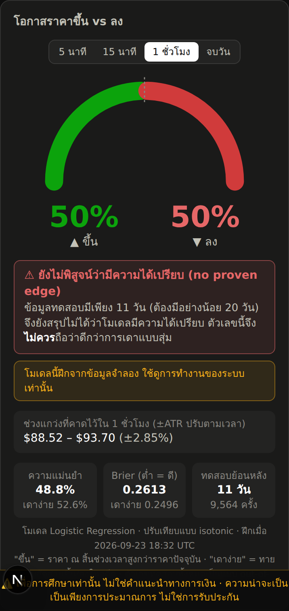

# คู่มือเริ่มต้นใช้งาน IREN Probability Analyzer (ภาษาไทย)

แอปนี้วิเคราะห์หุ้น **IREN** แบบเรียลไทม์ และประมาณ**โอกาสที่ราคาจะขึ้นหรือลง**ใน 5 นาที, 15 นาที, 1 ชั่วโมง หรือ ณ ราคาปิดของวัน

> ⚠️ **เพื่อการศึกษาเท่านั้น ไม่ใช่คำแนะนำทางการเงิน ความน่าจะเป็นเป็นเพียงการประมาณการ ไม่ใช่การรับประกัน**

รายละเอียดเชิงเทคนิคทั้งหมดอยู่ใน [README.md](README.md) (ภาษาอังกฤษ)



---

## 1. สิ่งที่ต้องมี

- คอมพิวเตอร์ Windows, Mac หรือ Linux
- **วิธีง่ายที่สุด:** ติดตั้ง [Docker Desktop](https://www.docker.com/products/docker-desktop/)
- **หรือแบบไม่ใช้ Docker:** ติดตั้ง [Python 3.11+](https://www.python.org/downloads/) และ [Node.js 20+](https://nodejs.org/)
- บัญชี [Alpaca](https://alpaca.markets) สำหรับดึงข้อมูลราคา (ฟรี)

## 2. สมัคร Alpaca และสร้าง API key

1. สมัครที่ https://alpaca.markets ใช้บัญชี **Paper Trading** (บัญชีทดลอง) ได้เลย ไม่ต้องฝากเงิน
2. เข้าหน้า Dashboard ของบัญชี **Paper** แล้วหา **API Keys** ทางด้านขวา
3. กด **Generate New Keys** แล้วคัดลอก **Key ID** และ **Secret Key** เก็บไว้
   - Secret Key จะแสดงแค่ครั้งเดียวเท่านั้น

> 🔒 **ห้าม**ส่ง key ให้ใครทางแชต และห้าม commit ไฟล์ `.env` ขึ้น GitHub

## 3. ดาวน์โหลดโปรเจกต์และใส่ key

```bash
git clone https://github.com/pattanarat49-lab/Iren-analyzer.git
cd Iren-analyzer
cp .env.example .env
```

บน Windows (PowerShell) ให้ใช้คำสั่ง `copy .env.example .env` แทนบรรทัดสุดท้าย

เปิดไฟล์ `.env` ด้วยโปรแกรมแก้ข้อความ (เช่น Notepad หรือ VS Code) แล้วใส่ key:

```
ALPACA_API_KEY_ID=PKxxxxxxxxxxxx
ALPACA_API_SECRET_KEY=xxxxxxxxxxxxxxxxxxxx
```

ถ้ายังไม่ใส่ key แอปจะเปิดใน**โหมดข้อมูลจำลอง** จะมีแถบสีเหลืองขึ้นเตือน เหมาะสำหรับลองดูหน้าตาแอปก่อน

## 4. เปิดแอป

### วิธี A: ใช้ Docker (แนะนำ)

```bash
docker compose up --build
```

รอจนขึ้นข้อความว่าพร้อมใช้งาน แล้วเปิด **http://localhost:3000**

### วิธี B: ไม่ใช้ Docker (เปิด terminal 2 หน้าต่าง)

**หน้าต่างที่ 1: backend**

```bash
cd backend
python3 -m venv .venv
source .venv/bin/activate
pip install -r requirements-dev.txt
uvicorn app.main:app --port 8000
```

บน Windows ให้ใช้ `.venv\Scripts\activate` แทนบรรทัด `source .venv/bin/activate`

**หน้าต่างที่ 2: frontend**

```bash
cd frontend
npm install
npm run dev
```

แล้วเปิด **http://localhost:3000**

- **ดูบนมือถือ:** ให้มือถือต่อ Wi-Fi เดียวกับคอมพิวเตอร์ แล้วเปิด `http://<IP ของคอมพิวเตอร์>:3000`

## 5. ดึงข้อมูลย้อนหลังและฝึกโมเดล (ทำครั้งแรกครั้งเดียว)

โมเดลความน่าจะเป็นต้องเรียนรู้จากข้อมูลจริงย้อนหลัง 2 ปีก่อน รันคำสั่งเหล่านี้ในโฟลเดอร์ `backend`:

```bash
python -m scripts.backfill     # ดึงข้อมูลแท่ง 1 นาที ย้อนหลัง 2 ปี (ประมาณ 10–30 นาที)
python -m scripts.train        # ฝึกโมเดลทั้ง 4 ช่วงเวลา (ไม่กี่นาที)
python -m scripts.backtest     # (ไม่บังคับ) สร้างรายงานผลทดสอบย้อนหลังในโฟลเดอร์ reports/
```

ถ้าใช้ Docker ให้เติม `docker compose exec backend` ไว้ข้างหน้าแต่ละคำสั่ง เช่น `docker compose exec backend python -m scripts.backfill`

หลังจากนี้ระบบจะทำงานเองอัตโนมัติ:
- **บันทึกการทำนายทุก 1 นาที** และเทียบกับราคาจริงเมื่อครบเวลา ดูผลได้ที่หน้า `/track-record`
- **ฝึกโมเดลใหม่ทุกวันทำการ** เวลา 07:30 น. (เวลาไทย) หลังตลาดสหรัฐฯ ปิดช่วง after-hours

## 6. วิธีอ่านหน้าจอ

| ส่วน | ความหมาย |
|---|---|
| **ราคาด้านบน** | ราคาล่าสุด การเปลี่ยนแปลงเทียบราคาปิดก่อนหน้า เวลาอัปเดตทั้งเวลา ET และเวลาไทย สถานะตลาด และสถานะการเชื่อมต่อ |
| **มาตรวัดขึ้น vs ลง** | โอกาสขึ้น/ลงของช่วงเวลาที่เลือก |
| **ช่วงแกว่งที่คาดไว้** | ช่วงราคาที่มักแกว่งในช่วงเวลานั้น คำนวณจาก ATR |
| **กราฟราคา** | แท่งเทียนพร้อมเส้น EMA, VWAP, Bollinger และช่อง RSI, MACD ด้านล่าง ชี้ที่กราฟเพื่อดูตัวเลข |
| **ปัจจัยที่มีผล** | สิ่งที่ดันให้โมเดลคิดว่าขึ้น (▲) หรือลง (▼) ไม่ได้แปลว่าเป็นสาเหตุจริง |
| **สัญญาณอินดิเคเตอร์** | ค่า สัญญาณ (บวก/ลบ/กลาง) และคำอธิบายสั้นๆ ของแต่ละตัว |
| **เทียบหุ้นที่เกี่ยวข้อง** | IREN แข็งหรืออ่อนกว่า CIFR, NBIS, CRWV, NVDA, QQQ, BTC และเคลื่อนไหวไปด้วยกันแค่ไหน |
| **ผลงานจริง** (`/track-record`) | อัตราทายถูก และกราฟ calibration (ทาย X% แล้วขึ้นจริงกี่ %) จากการทำนายจริงทุกครั้ง ไม่มีการคัดเลือก |

**ถ้าเห็นกรอบแดง "⚠ ยังไม่พิสูจน์ว่ามีความได้เปรียบ (no proven edge)":**
- หมายความว่าในการทดสอบย้อนหลัง โมเดลยังไม่ดีกว่าการเดาแบบง่ายอย่างมีนัยสำคัญ
- ให้ถือว่าตัวเลขนั้น**ใกล้เคียงการโยนเหรียญ**
- เรื่องนี้เกิดได้บ่อยมากกับหุ้นตัวเดียวในช่วงเวลาสั้นๆ และแอปตั้งใจแสดงให้เห็นตรงๆ

## 7. นำขึ้นอินเทอร์เน็ต (สรุป)

1. **Backend:** ใช้ Railway หรือ Fly.io
   - ต้องเปิดตลอดเวลา และมีดิสก์ถาวร (Volume) ที่ `/app/var`
   - ใส่ key เป็น Variables/Secrets ของผู้ให้บริการ
   - แนะนำ RAM อย่างน้อย 2 GB
2. **Frontend:** ใช้ Vercel
   - ตั้ง Root Directory เป็น `frontend`
   - ตั้ง `NEXT_PUBLIC_BACKEND_URL` เป็น URL ของ backend
3. นำ URL ของ Vercel ไปใส่ใน `CORS_ORIGINS` ของ backend

ขั้นตอนละเอียดทีละคลิกอยู่ใน [README.md หัวข้อ 6](README.md#6-deploy-to-the-internet)

## 8. ปัญหาที่พบบ่อย

| อาการ | วิธีแก้ |
|---|---|
| มีแถบเหลือง "ข้อมูลจำลอง" | ยังไม่พบ key: ตรวจชื่อตัวแปรในไฟล์ `.env` แล้วปิด-เปิด backend ใหม่ |
| ขึ้น "Alpaca rejected the request" | key ผิด หรือตั้ง `ALPACA_STOCK_FEED=sip` ทั้งที่ใช้แผนฟรี (ต้องเป็น `iex`) |
| หน้าเว็บขึ้น "ติดต่อเซิร์ฟเวอร์ไม่ได้" | backend ไม่ได้เปิดอยู่ หรือ URL/CORS ตั้งไม่ตรงกัน |
| มาตรวัดขึ้น "ยังไม่ได้ฝึกโมเดล" | รัน `python -m scripts.backfill` แล้วตามด้วย `python -m scripts.train` |
| ราคาไม่ขยับ | ตลาดสหรัฐฯ ปิดอยู่ (ช่วงซื้อขายปกติคือ 20:30–03:00 น. เวลาไทย ในช่วง Daylight Saving) ส่วน BTC ซื้อขาย 24 ชม. |

---

*เพื่อการศึกษาเท่านั้น ไม่ใช่คำแนะนำทางการเงิน*
